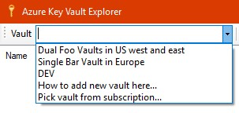
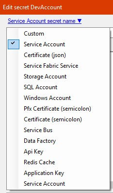
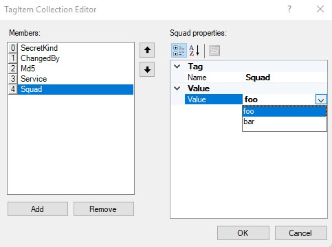
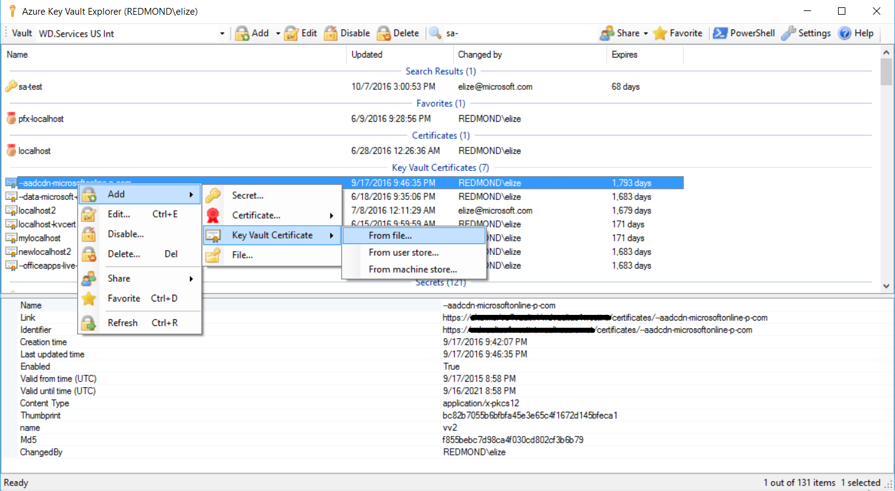
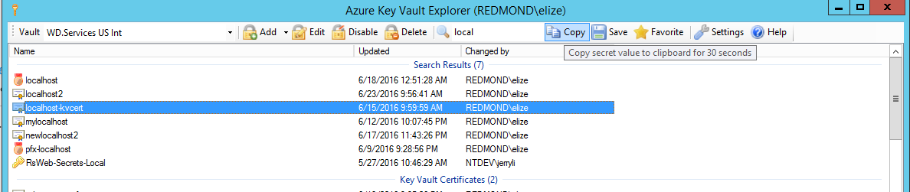
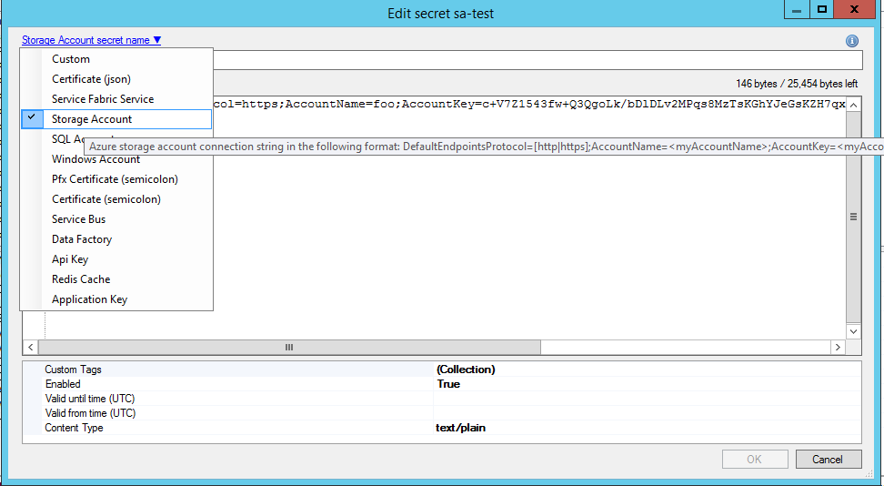
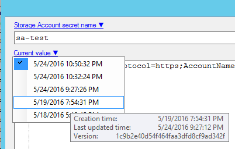
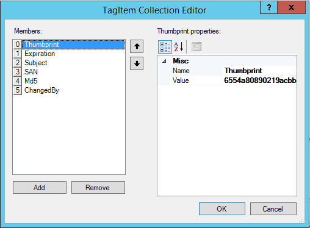
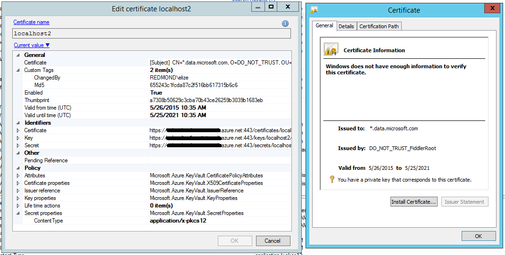
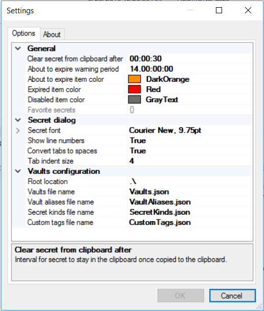

#  Azure Key Vault Explorer

Azure Key Vault Explorer - be productive when working with secrets!

#### [Click here to install the latest version (https://aka.ms/ve)](https://aka.ms/ve)

Authors: Eli Zeitlin, Gokhan Ozhan, Anna Zeitlin  
Contact: [Azure Key Vault Explorer Developers](mailto:Azure Key Vault Explorer Developers <vedev@microsoft.com>>)

## Table of Contents
  * [Key features](#key-features)
  * [How to add or open new vaults](#how-to-add-or-open-new-vaults)
  * [Keyboard and mouse shortcuts](#keyboard-and-mouse-shortcuts)
  * [Configuration](#configuration)
    * [Vaults.json](#vaultsjson)
    * [SecretKinds.json](#secretkindsjson)
    * [CustomTags.json](#customtagsjson)
    * [VaultAliases.json](#vaultaliasesjson)
    * [User.config](#userconfig)
  * [Telemetry](#telemetry)
  * [Screen shots](#screen-shots)
      * [Main window](#main-window)
      * [Search and copy secret to clipboard](#search-and-copy-secret-to-clipboard)
      * [Edit secret](#edit-secret)
      * [Rollback to specific secret version](#rollback-to-specific-secret-version)
      * [Edit secret tags](#edit-secret-tags)
      * [Edit Key Vault certificate](#edit-key-vault-certificate)
      * [Settings window](#settings-window)

## Key features
* Best user experience for authentication, you will be prompted at most *once* to enter your credentials
* All types of authentications are supported: Certificate, Secret and User based with 2FA (including PHX or GME)
* One click activation, just run this: `https://aka.ms/ve?vault://[ENTER HERE YOUR VAULT NAME]`
* Support single or dual vaults
* Upload and download certificate (.pfx, .p12 and .cer) files
* Import and export certificates to user or machine stores in just few clicks
* Support both secret based certitifactes and new Azure Key Vault Certificates, for more details see here:  http://aka.ms/kvssl 
* Secret compression, to allow secrets which are bigger than 25 KB limit
* Drag and Drop of certificates and secrets to / from Windows Explorer or another instance of Vault Explorer
* Copy secret to clipboard for a configurable short time, just hit Ctrl + C
* Share certificate or secret in a safely manner, by copying link (Ctrl + Shift + C) to the item and pasting it anywhere (email, IM, desktop, etc.)
* Export all or selected items to .tsv file for future analysis or reporting 
* Favorite items per vault
* Explore your vaults and access policy from your subscriptions
* Open PowerShell session with currently selected vaults and quickly automate things
* Fast regex based search to quickly find the secret by any metadata
* Customizable regex based secret kinds to verify secret name and value and auto extract non-secret info to Tags, plus guide use with secret value template
* Custom required and optional tags per secret
* Custom tags as columns in the list view (Right click on columns header bar)
* Syntax highlight for well-known formats, such as: json, xml, config
* Build it auditing for all operations
* Disable or expiry item in a click of a button
* Default and maximum expiration per seceret kind and different coloring based on expiration period left 
* Certificate and secret revision control, rollback to previous value with just a click 
* Quickly detects duplication of secrets
* Generate secure password, new guid or new api key as a secret value with single click
* Usage telemetry and diagnostic instrumentation
* Auto update of the bits

## How to add or open new vaults
There are 4 ways how you can make Vault Explorer to work with your vaults:  
1. In case Vault Explorer is not installed on the box, you may just run: `https://aka.ms/ve?vault://[ENTER HERE YOUR VAULT NAME]`  
2. In case Vault Explorer already installed on the box, you can just hit Win+R type `vault://[ENTER HERE YOUR VAULT NAME]` and hit Enter
    * Note: The above two methods do **NOT** allow for alternative account login  
3. Run Vault Explorer, open vault combo box, select last item "Pick vault from subscription..."  
4. Below is *the recommended way*, as it gives you a full control around vaults, aliases, access and secret kinds.  
Just complete the below fairly easy manual steps *once*:
* Run Vault Explorer
* Click on Settings, then go to About tab, and hit Install Location.
* Copy Vaults.json, SecretKinds.json, CustomTags.json and VaultAliases.json (see below in the Configuration section what these files are)
* Put all four files in some local folder let say "C:\Users\<YourAlias>\My Documents\VaultExplorerConfig\" or some share folder which will be accessible to your team
* Edit each file accordingly, read the Configuration section below 
* Go back to Options tab in the Settings dialog, and change "Root location" from .\ to point to where you put all four files
* Hit OK button

## Keyboard and mouse shortcuts
* Drag with Left mouse button - initiate drag & drop operation with *basic* item information (name and value only) 
* Drag with Ctrl + Left mouse button - initiate drag & drop operation with *all* item information (name, value, tags, attributes)
* Drag with Ctrl + Shift + Left mouse button - initiate drag & drop operation as a link to the item (also known as shortcut)
* F1 - open help
* F5 - refresh list
* Insert - add new item
* Delete - delete item(s)
* Enter - edit item
* Ctrl + A - select all items
* Ctrl + C - copy item value to clipboard for some time (configurable)
* Ctrl + Shift + C - copy link to the selected item in the following format: `https://aka.ms/ve?vault://vaultName/collection/itemName/version`
* Ctrl + D - add item to favorites / remove item from favorites
* Ctrl + E - edit item
* Ctrl + F - find items
* Ctrl + R - refresh list
* Ctrl + S - save item to file

## Configuration
There are five configuration files which controls Vault Explorer behaviour.
### Vaults.json
Defines a dictionary of vault names and how access is gained. This is especially useful if the account that is running Vault Explorer does not have access to certain vaults. Customize this file to add credentials for specific vaults. Otherwise, editing this file is optional if the current account has access to the specified vault. Vault names are used later in *VaultAliases.json*. Vault Explorer uses only *ReadWrite* access. Supported Vault Access types are: 
* VaultAccessClientCertificate - client id (application id) in AzureAD will be selected with right certificate thumbprint (sha1) of the application's principal to get the access
* VaultAccessClientCredential - client id and client secret will be used to get the access
* VaultAccessUserInteractive - client id (powershell app id) and user credentials will be used to get the access. By default `[your alias]@microsoft.com` is used, in case you would like to use another domain (for example gme.gbl), just add the key `"DomainHint": "gme.gbl"`, if you would like to use an alternate account to login, add the key `"UserAliasType": "Alt"`

In case of dual vaults (primary and secondary) use $id and $ref to avoid duplication. Here an example for dual vault configuration.

```
{
  "myVault": {
    "$id": "1",
    "ReadOnly": [
      {
        "$type": "Microsoft.Vault.Library.VaultAccessClientCertificate, Microsoft.Vault.Library",
        "ClientId": "00000000-0000-0000-aaaa-aaaaaaaaaaaa",
		"CertificateThumbprint": "0000000000000000000000000000000000000000"
      }
    ],
    "ReadWrite": [
      {
        "$type": "Microsoft.Vault.Library.Vault.VaultAccessClientCertificate, Microsoft.Vault.Library",
        "ClientId": "00000000-0000-0000-aaaa-aaaaaaaaaaaa",
        "CertificateThumbprint": "0000000000000000000000000000000000000000"
      },
      {
        "$type": "Microsoft.Vault.Library.VaultAccessClientCredential, Microsoft.Vault.Library",
        "ClientId": "00000000-0000-0000-aaaa-aaaaaaaaaaaa",
        "ClientSecret": "aXRoIEJhc2U2NCBmb3Jtsdfsdf5534YXQ/IFRoZW4="
      },
      {
        "$type": "Microsoft.Vault.Library.VaultAccessUserInteractive, Microsoft.Vault.Library",
        "DomainHint": "xxx.yyy",
        "UserAliasType": "Alt" 
      }
    ]
  },
  "myVault": {
    "$ref": "1"
  }
}
```

### VaultAliases.json
Defines a list of vault aliases that can be used to quickly access certain vaults. VaultNames do not need to be defined in *Vaults.json*. Each vault alias is a simple class with the following properties:
* Alias - nice alias for the vault(s)
* VaultNames - array with single or dual vault names that may be defined in *Vaults.json*, specifying the vault in *Vaults.json* is not required if the current account has access to the vault(s).
* SecretKinds - array with at least one secret kind which are defined in *SecretKinds.json*, this controls which secret kinds are allowed for the vault(s)

Here an example for vault alias element in the array:
```
  {
    "Alias": "Test Alias",
    "VaultNames": [ "myVault1", "myVault2" ],
    "SecretKinds": [ "Custom", "Service.Secret" ]
  },
```
Here is an example of a single vault not defined in *Vaults.json*
```
  {
    "Alias": "DEV",
    "VaultNames": [ "TestKeyVault" ]
  }
```

### SecretKinds.json
Defines a dictionary of different secret kinds. Secret kind names can be used in *VaultAliases.json* to limit the types of secrets available in a certain vault. Selecting a Secret Kind will also add a *SecretKind* custom tag to the secret that can be referenced by external programs and scripts. By default, any new Secret is a *Custom* secret and the *SecretKind* tag will not be populated. Secret Kind is a simple class with the following properties: 
* Alias - secret kind alias, presented in the secret kind list in New/Edit secret dialog.
* Description - secret kind description, used as a tool tip in the secret kind list and link in New/Edit secret dialog.
* NameRegex - valid secret name regular expression (case sensitive). NameRegex must be a "subset" of the following regex ```^[0-9a-zA-Z-]{1,127}$``` 
* ValueRegex - valid secret value regular expression (case sensitive). Each *named group* value will be auto-extracted to appropriate Tag of the secret (tag name will the the group name and tag value will be the matched string in this group). ValueRegex can be longer than 25KB, if one wants to allow secret compression *ContentType = application/x-json-gzb64*
* ValueTemplate - optional field, which guides the user how the secret should look like. Will be used during new secret flow.
* RequiredCustomTags - optional field, which contain array of required custom tags that must be present as part of the secret kind, see *CustomTags.json* 
* OptionalCustomTags - optional field, which contain array of optional custom tags that may be present as part of the secret kind, see *CustomTags.json*
* DefaultExpiration - optional field. Controls default expiration interval for the new secret.
* MaxExpiration - optional field. Controls maximum allowed expiration interval for the secret.

Here an example for storage account secret kind:

```
  "My.StorageAccount": {
    "Alias": "Storage Account",
    "Description": "Azure storage account connection string in the following format: DefaultEndpointsProtocol=[http|https];AccountName=<myAccountName>;AccountKey=<myAccountKey>",
    "NameRegex": "^sa-(?<AccountName>[0-9a-z]{3,24})(?<Region>|-cus|-eus|-eus2|-ugi|-ugv|-ncu|-scu|-wus|-neu|-weu|-eas|-sas|-ejp|-wjp|-sbr|-eau|-sau|-all)$",
    "ValueRegex": "^DefaultEndpointsProtocol=(http|https);AccountName=(?<AccountName>[0-9a-z]{3,24});AccountKey=((?:[A-Za-z0-9+\/]{4})*(?:[A-Za-z0-9+\/]{2}==|[A-Za-z0-9+\/]{3}=)?)$",
    "ValueTemplate": "DefaultEndpointsProtocol=https;AccountName=...;AccountKey=...",
    "RequiredCustomTags": [ "MyTag" ],
    "OptionalCustomTags": [ "MyOptionalTag" ],
    "DefaultExpiration": "180.00:00:00",
    "MaxExpiration":  "180.00:00:00"
  },
```

Note: Total number of RequiredCustomTags and OptionalCustomTags must be less than 15 for any secret kind.



### CustomTags.json
Defines a dictionary for different secret custom tags. Custom tags must be added to *SecretKinds.json* in the 'RequiredCustomTags' or 'OptionalCustomTags' sections.
Each cutom tag is a simple class with the following properties: 
* Name - the custom tag name, must be less than 256 chars
* DefaultValue - default value for the tag, for no value just put ""
* ValueRegex - valid tag value regular expression (case sensitive), must be no longer 256 chars
* ValueList - (optional) an array of strings or numbers that will be shown in a dropdown

Here are examples for couple of custom tags:

```
{
  "MyTag": {
    "Name": "Tag",
    "DefaultValue": "foo",
    "ValueRegex": ".{0,256}",
    "ValueList": [
      "foo",
      "bar"
    ]
  },
  "MyOptionalTag": {
    "Name": "Description",
    "DefaultValue": "",
    "ValueRegex": ".{0,256}"
  }
}
```


### User.config
XML file which controls user settings, will be created only if user changed the default values via Settings dialog and clicked OK button.
Here an example for location of the file:  
```
%LocalAppData%\Apps\2.0\Data\2310EVQO.1C1\Q6P3APKG.HY4\vaul..tion_7446cb71d1187222_07e0.03f5_fc3133cd208276e1\Data\2016.1013.1742.39\user.config
```

## Telemetry
By default Azure Key Vault Explorer collects and sends aggregated telemetry to Application Insights about usage of the tool. Telemetry includes only the following:
* Type of user actions - which button / menu item was clicked
* Action duration – how long time particular action took (for example: action to save a secret)
* Exceptions – only in case action failed, for diagnostic purposes only exception information is collected

All collected telemetry is stored for no more than 90 days.
Telemetry can be disabled in the Settings dialog. Set *Disable telemetry* to *True*, hit *OK* button and restart the application.

## Screen shots

#### Main window


#### Search and copy secret to clipboard


#### Edit secret


#### Rollback to specific secret version


#### Edit secret tags


#### Edit Key Vault certificate


#### Settings window

